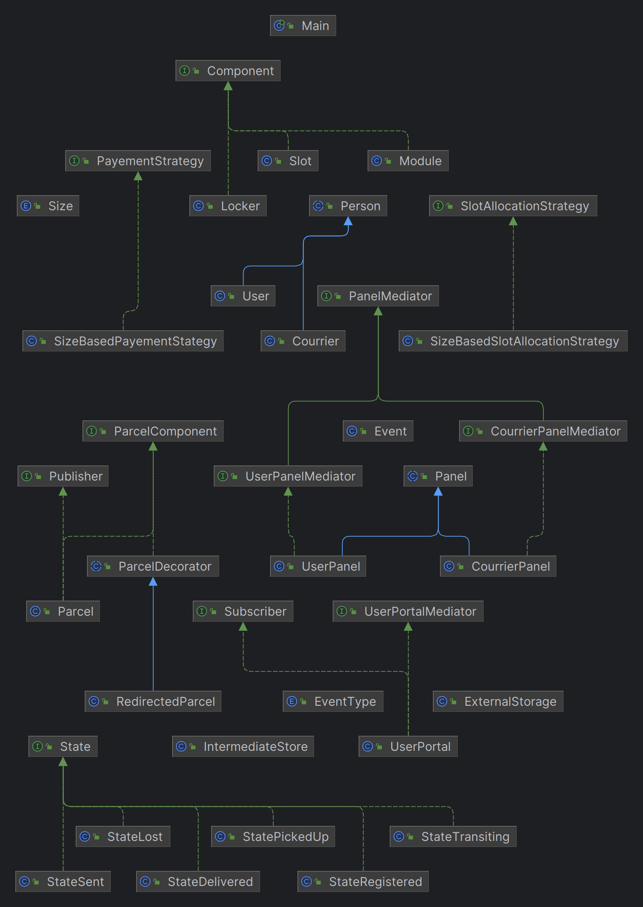

# Software Design & Modeling - Assignement 2
## Erwann GAUTHIER (ER1684) & Mouad MERROUCHI (ER1686)

For this second version of this Assignment, we've completely reimplemented the code we'd made, as it was far too coupled and difficult to maintain.
We re-implemented the code by trying to implement design patterns, implementing the following:
- The Composite structural pattern for the Locker, Module and Slot classes.
- The Singleton creationnal pattern for the UserPortal class.
- The Strategy behavioral pattern for the UserPortal (SizeBasedPaymentStrategy) and Locker (SlotAllocationStrategy) classes.
- The Mediator behavioral pattern for the UserPortal, UserPanel and CourrierPanel classes.
- The State behavioral pattern for the Parcel class.
- The Observer behavioral pattern for the Parcel (Publisher) and UserPortal (Subscriber) classes.
- The Decorator structural pattern for the Parcel and RedirectedParcel classes.

We encountered problems in implementing the Decorator pattern, so the feature of sending the parcel to external storage didn't work.

In addition, we haven't found a correct way of informing a Courier that it has a parcel to retrieve when the parcel is deposited in the sender's locker (changes status to Sent).

